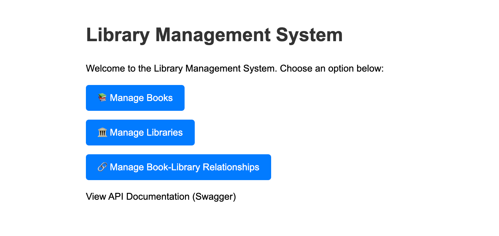
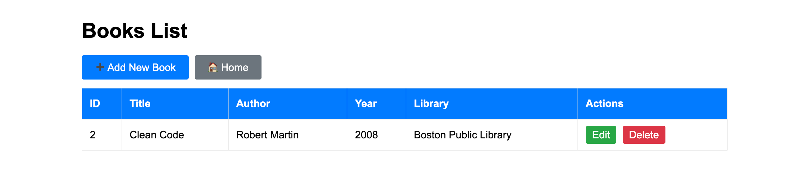
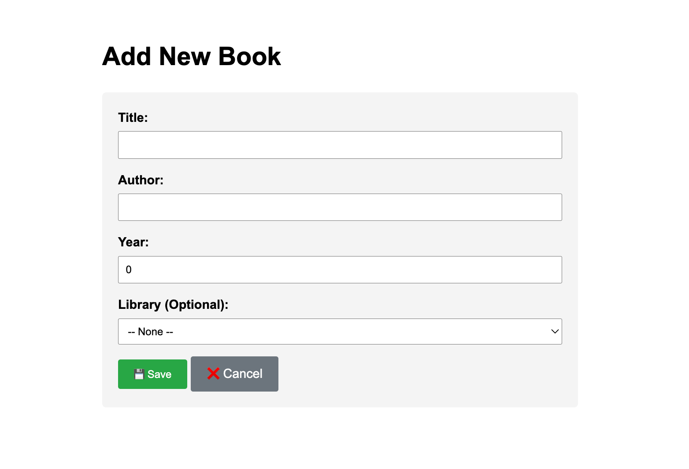
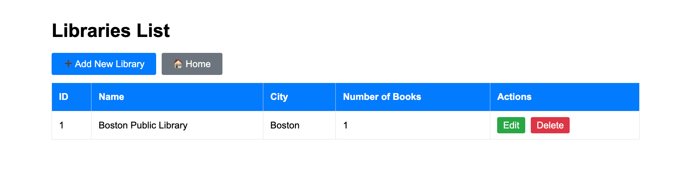
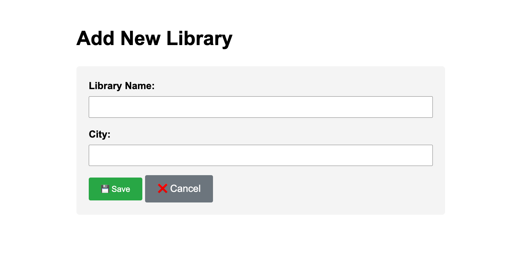
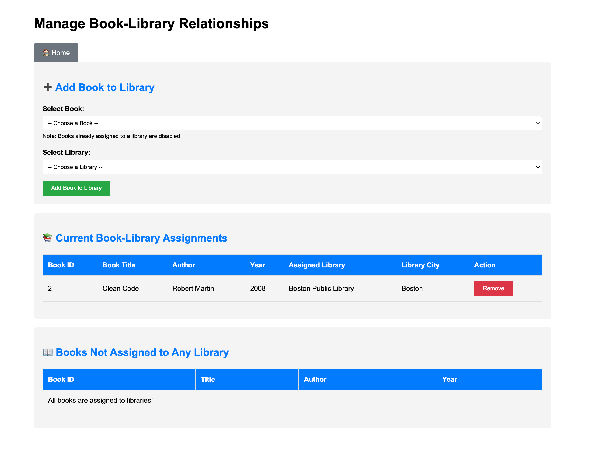

# Library Management System

A full-stack web application for managing books and libraries, built with Spring Boot, Thymeleaf, and SQLite. Features both a RESTful API and a web interface for complete CRUD operations.



## 🚀 Features

### Books Management
- Create, view, edit, and delete books
- Assign books to libraries via dropdown selection
- Track book details: title, author, year, and library assignment

### Libraries Management
- Full CRUD operations for libraries
- Automatic book count tracking for each library
- Library details: name and city

### Relationship Management
- Dedicated page for managing book-library assignments
- Add books to libraries with dropdown menus
- Remove books from libraries
- View unassigned books separately
- Real-time updates to book counts

### API Documentation
- Interactive Swagger/OpenAPI documentation
- Test all endpoints directly in the browser
- Available at `/swagger-ui/index.html`

## 🛠️ Tech Stack

- **Backend:** Spring Boot 3.2.0, Java
- **Frontend:** Thymeleaf template engine
- **Database:** SQLite with JPA/Hibernate
- **Build Tool:** Maven
- **Containerization:** Docker
- **API Docs:** Swagger/OpenAPI

## 📸 Screenshots

### Home Page
The landing page with navigation to all three main features.


### Books Management
View all books in a table with edit and delete options.



Create or edit books with the form interface.



### Libraries Management
Manage libraries with automatic book count tracking.



Add or edit library information.



### Relationship Management
The most comprehensive feature - manage which books belong to which libraries.



Three sections:
1. **Add Book to Library** - Assign books using dropdown menus
2. **Current Assignments** - See all book-library relationships with remove buttons
3. **Unassigned Books** - Track books that haven't been placed yet

## 🏃 How to Run

### Prerequisites
- Java 17 or higher
- Maven 3.6+
- Docker (optional, for containerized deployment)

### Running Locally

1. **Clone the repository**
```bash
   git clone https://github.com/rayanedebbarh/Library-Management-System.git
   cd Library-Management-System
```

2. **Build the project**
```bash
   mvn clean install
```

3. **Run the application**
```bash
   mvn spring-boot:run
```

4. **Access the application**
   - Web UI: http://localhost:8081/web/
   - API Documentation: http://localhost:8081/swagger-ui/index.html
   - REST API: http://localhost:8081/api/

### Running with Docker

1. **Build the Docker image**
```bash
   docker build -t library-management-system .
```

2. **Run the container**
```bash
   docker run -p 8081:8081 library-management-system
```

## 🔌 API Endpoints

### Books
- `GET /api/books` - Get all books
- `GET /api/books/{id}` - Get book by ID
- `POST /api/books` - Create new book
- `PUT /api/books/{id}` - Update book
- `DELETE /api/books/{id}` - Delete book

### Libraries
- `GET /api/libraries` - Get all libraries
- `GET /api/libraries/{id}` - Get library by ID
- `POST /api/libraries` - Create new library
- `PUT /api/libraries/{id}` - Update library
- `DELETE /api/libraries/{id}` - Delete library

Full API documentation available at `/swagger-ui/index.html` when running.

## 📁 Project Structure
src/
├── main/
│   ├── java/app/
│   │   ├── controller/     # REST and Web controllers
│   │   ├── model/          # JPA entities (Book, Library)
│   │   ├── repository/     # Data access layer
│   │   ├── service/        # Business logic
│   │   └── llm/            # Groq LLM integration
│   └── resources/
│       ├── templates/      # Thymeleaf HTML templates
│       └── application.properties
└── pom.xml
## 🎓 Academic Context

Built as a semester-long project for CSC-450 (Software Engineering) at Alma College. The project evolved from a command-line application through several activities:
- Activity 1-3: Command-line interface and core logic
- Activity 4: Docker containerization
- Activity 5: REST API development
- Activity 6: Groq LLM integration for book lookups
- Activity 7: Database integration with JPA/SQLite
- Activity 8: Thymeleaf web UI (this interface)

All code includes AI usage documentation per course requirements. Claude AI assisted with Thymeleaf syntax and controller patterns, while business logic, debugging, and testing were done manually.

## 🤝 Contributors

- **Rayane Debbarh** - Development and implementation
- **Hiba** - Project management, documentation, and Jira coordination

## 🔧 Known Issues & Future Improvements

### Current Limitations
- Runs on port 8081 (8080 was occupied during development)
- SQLite database - suitable for development but would use PostgreSQL/MySQL for production
- No user authentication (all users can access all features)

### Potential Enhancements
- Add user authentication and role-based access control
- Implement search and filtering for books and libraries
- Add pagination for large datasets
- Export book lists to CSV/PDF
- Multi-library book support (currently one book = one library)
- Better error handling and validation messages
- Responsive design improvements for mobile devices

## 📧 Contact

**Rayane Debbarh**
- GitHub: [@rayanedebbarh](https://github.com/rayanedebbarh)
- LinkedIn: [Your LinkedIn Profile]
- Email: [Your Email]

## 📝 License

This project was created for educational purposes as part of coursework at Alma College.

---

*Built with Spring Boot, Thymeleaf, and a lot of debugging 🚀*
